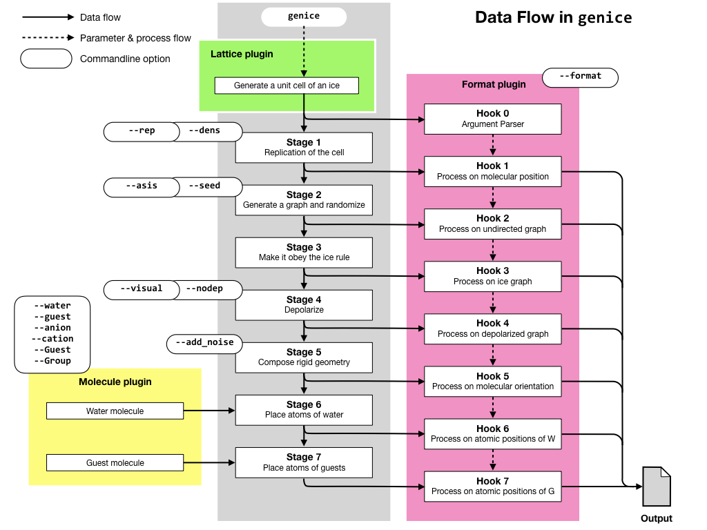
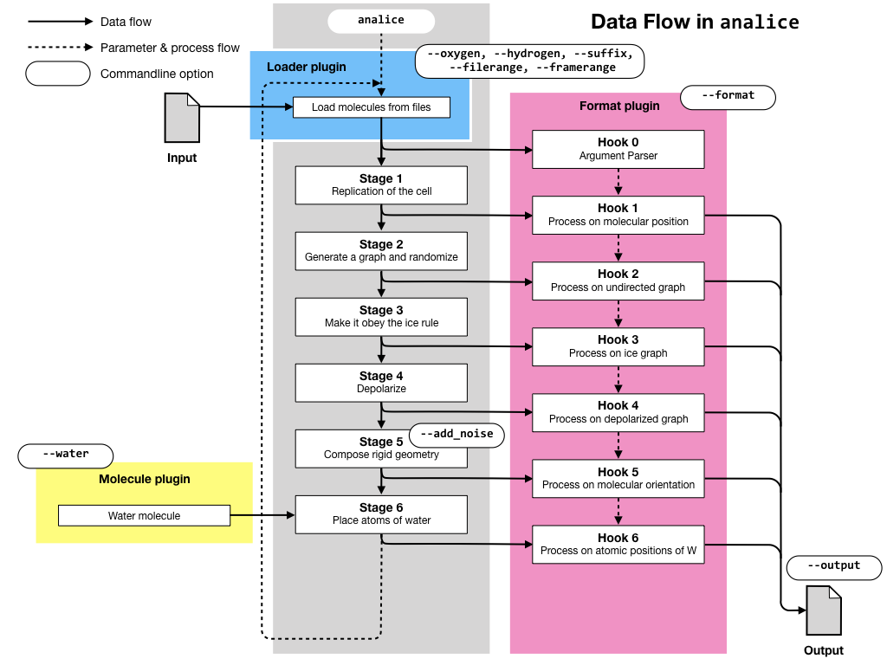

# GenIceについて

氷の中では、水分子はそれぞれが格子点の位置を占めており、隣接する水分子の間は水素結合がつないでいますが、その水素結合の向きに乱雑さがあります。氷の結晶はこの意味で単一の結晶構造ではなく、多数の異なる水素結合配列のアンサンブルとみなせます。氷の物性を評価する場合には、これらの構造を適切に生成し、アンサンブル平均をとるとともに、配置エントロピー(Pauling エントロピー)を考慮する必要があります。

GenIceは、氷の幾何学的・トポロジー的規則性(アイスルール)を満たした結晶構造のアンサンブルを生成するツールです。GenIceが生成する氷の構造は、全分極が0であることが保証されます(0でない構造を生成することも可能です)。

GenIceには、生成した構造が確かに十分ランダム化されているかどうかを検定するツールも含まれています。

GenIceは、クラスレートハイドレートの結晶構造を生成することもできます。この時、ケージの中に一定割合でゲスト分子(の混合物)を入れることができます。

さらに、氷の格子の一部をイオンで置きかえた、doped iceを生成することもできます。

GenIceは多様なデータ形式を出力できます。また、ユーザーがプラグインを追加して、新しいフォーマットに対応することも容易です。

# インストール


# 生成手順
## 7つのステージ

GenIceは、単位胞の構造情報から、7つのステージをへて氷の大きな結晶構造を生成します。各ステージでは、処理のあとにFormatプラグイン内で定義されたHook関数が呼びだされ、この関数が出力データを作りだします。

Hook関数が定義されていない場合には、不必要な処理は行われません。例えば、指定したFormatプラグインがHook 1 (水分子の重心位置だけに基いた処理)だけを定義している場合には、Stage 2以降は実行されません。

### `genice` command

下の図にはおおまかな処理の流れが描かれています。実線がデータの流れ、破線は付帯するパラメータの流れやプログラムの流れを表しています。また、各オプションがどのプロセスに作用するかを示してあります。



### `analice` command

下の図にはおおまかな処理の流れが描かれています。実線がデータの流れ、破線は付帯するパラメータの流れやプログラムの流れを表しています。`analice`は複数のファイルを読みこんで処理を行い、複数のファイルを出力します。

`analice`では、7つのステージのうちいくつかは必要な場合のみ呼びだされます。読み込んだ分子座標が、個々の原子の座標まで含んでいる場合には、ステージ2〜5は実行されませんが、含んでいない場合にはこれらのステージにより分子配向が決定されます。各ステージの処理が実行されるかどうかにかかわらず、Hookは実行されます。



# プラグイン

GenIceでは、さまざまな機能をプラグインで実現しています。プラグインにはformat, lattice, molecule, loaderの4種類があり、それぞれが適切なタイミングで呼び出されます。

ユーザーが独自に作成したプラグインを利用することも容易です。

## Latticeプラグイン

結晶構造(単位胞の大きさ、形、分子の位置、結合)を定義するプラグインです。例えば、氷IIの構造を生成する場合には、次のようなコマンドを実行します。

    % genice 2 > 2.gro
	
この時、GenIce内部では、lattices/2.pyプラグインが呼び出されて、水分子の配置を定義しています。GenIceには数百種類の氷の構造があらかじめlatticeプラグインとして準備されています。また、ユーザーが独自の氷の構造を定義することもできます。

## Moleculeプラグイン

水分子のモデルを定義するプラグインです。例えば、水分子モデルとしてTIP4P (4サイトモデル)を採用したい場合には、以下のように`-w`オプションで分子モデルを指定します。

    % genice CS2 -w tip4p > CS2.gro
	
moleculeプラグインは、クラスレートハイドレートのゲスト分子を指定する場合にも呼び出されます。また、ユーザーが独自の分子を定義することもできます。

## Formatプラグイン

出力形式を定義するプラグインです。例えば、水分子の原子座標ではなく、重心位置とオイラー角を得たい場合には、次のように出力形式を指定します。

    % genice 3 -f euler > 3.euler

また、分子の座標を出力する代わりに、解析結果を出力するプラグインもあります。`_RDF`プラグインは、すべての原子種の間の動径分布関数を出力します。

    % genice 5 -f _RDF > 5.rdf

ユーザーが独自の出力フォーマットや解析手法をプラグインとして実装することも可能です。

formatプラグインは、結晶構造を生成する7つのステージの各段階で呼び出され、段階的に出力データを組みたてていきます。例えば、第2ステージまでで出力データが構成しおえた場合には、第3ステージ以降の処理は行われません。それぞれのプラグインが、そのステージでどんな処理を行うかを規定しています。

## Loaderプラグイン

geniceがlatticeプラグインを使って結晶構造を新規に生成するのに対し、analiceは既存の座標ファイルを読みこんで、それに対して処理を行います。analiceがさまざまなフォーマットの座標ファイルを読み込むために利用するのがloaderプラグインです。

通常、analiceは読み込むファイルの拡張子を見て、自動的にプラグインの種類を選びます。例えば、拡張子が`.gro`のファイルが指定された場合には、loaders/gro.pyプラグインが呼び出されます。`-s`オプションで、プラグインの種類を明示することも可能です。また、ユーザーが独自のloaderプラグインを実装することもできます。

| 拡張子 | プラグイン名 | ファイル形式 |
|-------|------------|------------|
| `gro`| `gro.py`   | Gromacs    |
| `mdv`| `mdv.py`   | MDView (Angstrom) |
| `mdva` | `mdva.py` | MDView (Atomic unit)|


## ユーザー定義プラグイン

`genice`/`analice`コマンドを実行するディレクトリ内に、`formats/`や`molecules/`といったサブディレクトリを作り、その中に自作のformatプラグインやmoleculeプラグインを入れておくと、それらもGenIceから利用できます。

自作プラグインのプログラム方法は、プラグインの種類によってかなり違います。
	

# 検定

geniceはさまざまな出力フォーマットに対応するformatプラグインをそなえています。そのうち、以下のプラグインは、生成した氷の構造が正しくランダムになっているかどうかを検定する目的に使用できます。

## `_ringstat`プラグイン

このプラグインは、geniceで生成したネットワーク構造に含まれる環を探し、その結合の向きの統計をとり、それが理想的な分布からどれぐらいずれているかを評価します。

水素結合には向きがあります。例えば、水素結合でできた四員環の辺にそって一周すすむと、その水素結合の向きは、順方向(F)か逆方向(B)の2通りで以下のような16種類の可能性があります。

* FFFF, FFFB, FFBF, FFBB, FBFF, FBFB, FBBF, FBBB, BFFF, BFFB, BFBF, BFBB, BBFF, BBFB, BBBF, BBBB

これらには、始点をずらしたり環を逆に回ったりすると同一視できるものが含まれています。重複を省くと、実質的には以下の4種類の向きがありえます。

* FFFF
* FFFB
* FFBB
* FBFB

これらの出現頻度は、次のような近似で。モデル化できます。

1. すべての節点は4結合である。
2. すべての節点で入結合2、出結合2である。(ice rule)
3. 注目する四員環以外には環がない。(ベーテ近似)

すると、これらの出現確率は、それぞれ

* FFFF: 16/41
* FFFB: 16/41
* FFBB: 8/41
* FBFB: 1/41

となります。

この近似と、geniceで生成したネットワーク内での環の向きの統計とを比較することで、ネットワーク構造が十分ランダム化されているかどうかを検定します。

以下の例では、氷VIの四員環の出現頻度を検定しています。

```bash
$ genice 6 -f _ringstat -r 4 4 4  |less

4 0 0000 16/41 0.39024 265/640 0.41406 
4 1 0001 16/41 0.39024 224/640 0.35000 
4 3 0011 8/41 0.19512 143/640 0.22344 
4 5 0101 1/41 0.02439 8/640 0.01250 
0.01205979926917721 4 dKL[4-ring]
...
```

第1カラムが環の大きさ、第3カラムが結合の向き(二進表現)、第2カラムはそれの10進表現、第4、5カラムがモデル分布(分数と小数)、第6、7カラムが生成した構造での分布となっています。また最後の行は、モデル分布と生成分布の間のKullback-Leibler Divergenceで、これが小さいほど2つの分布は近いと言えます。


## `_KG`プラグイン

Kirkwood Gは次のように定義され、双極子の遠距離相関を計量します。


# TIPS

## Installation

## Execution

### 実行時に`UnicodeEncodeError`が発生してファイルに書きこめない。

GenIceを実行しているTerminalのエンコーディング設定がUTF-8でない場合に起こります。環境変数`PYTHONIOENCODING`を`UTF-8`に設定して下さい。

```bash
% export PYTHONIOENCODING=UTF-8
```

